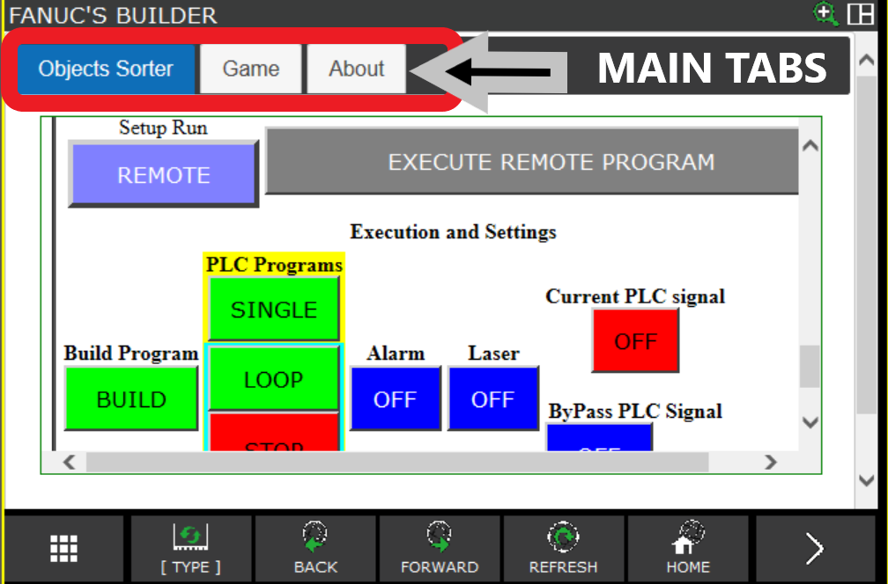
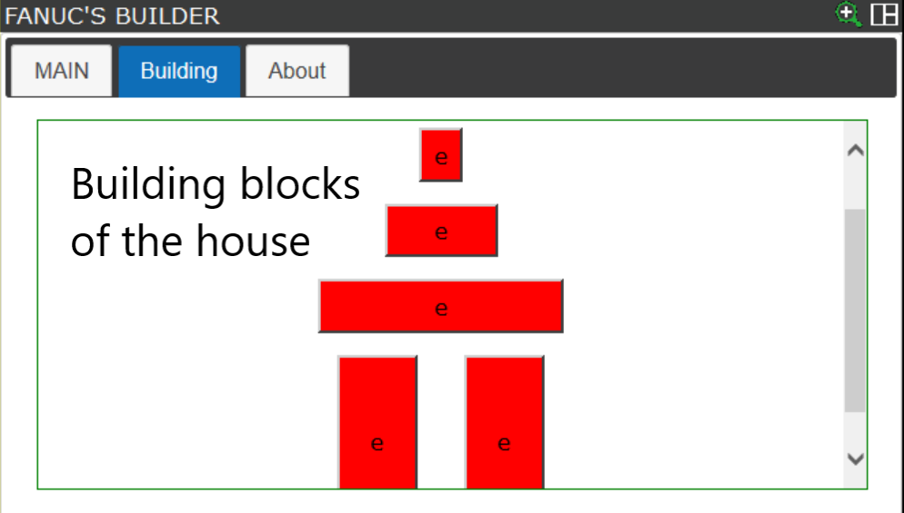
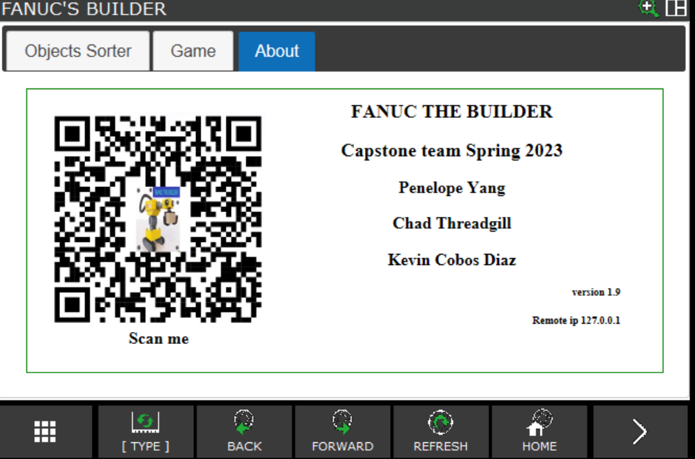
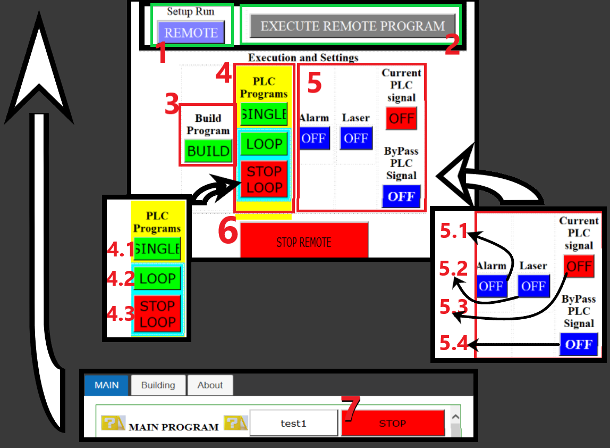
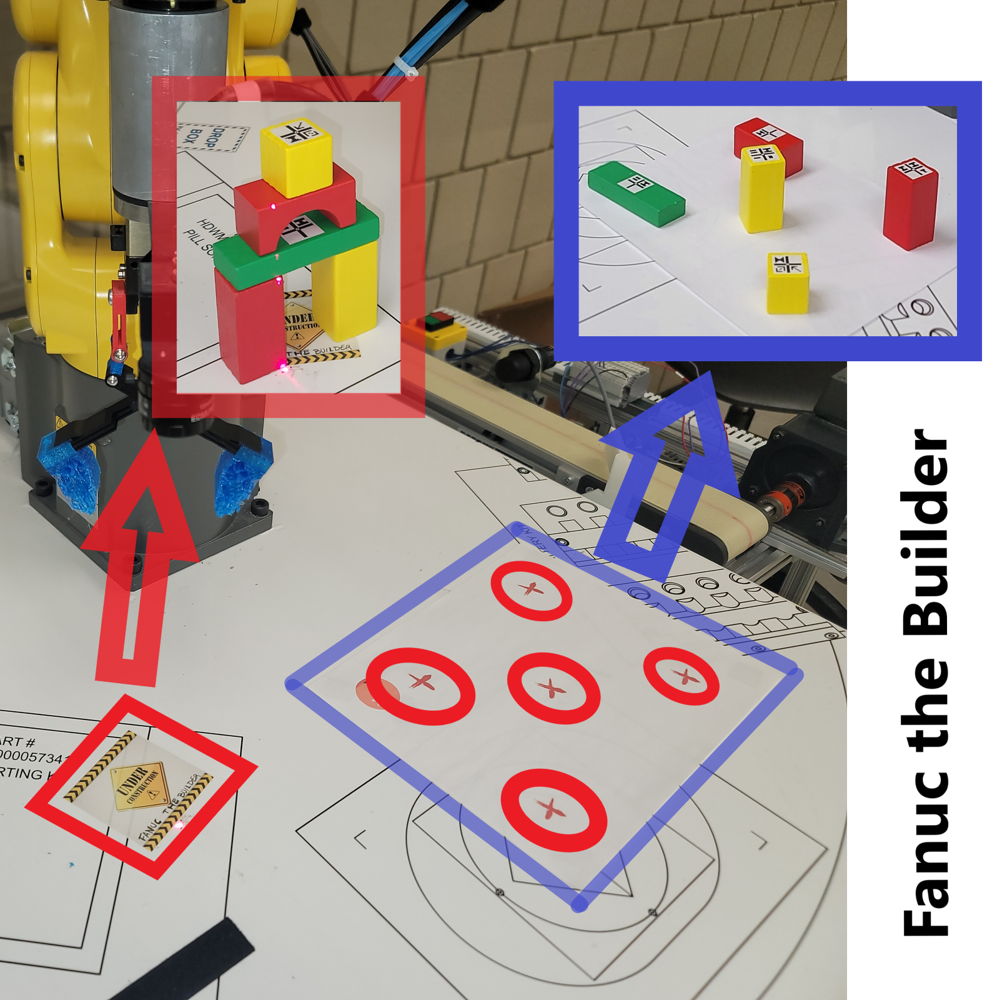
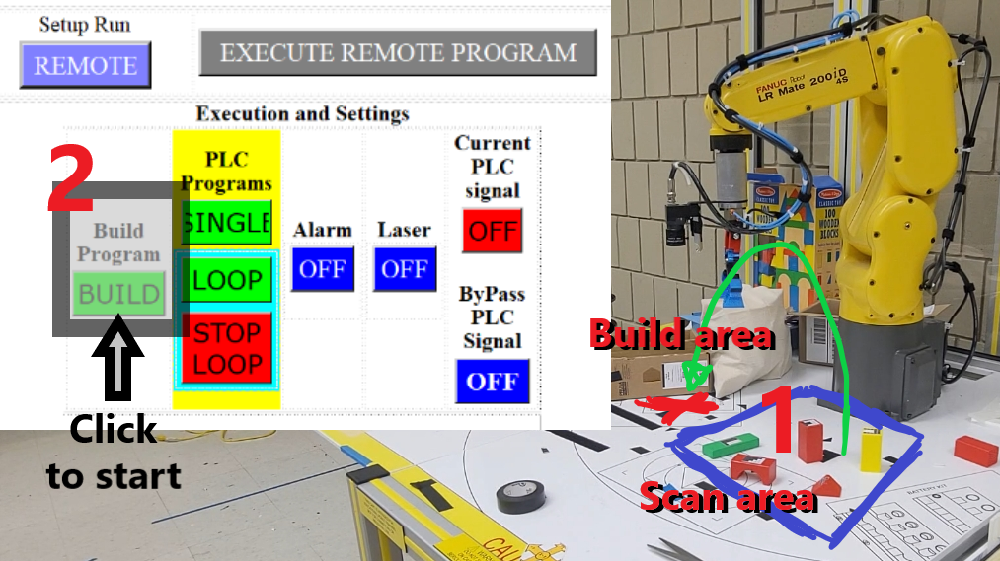
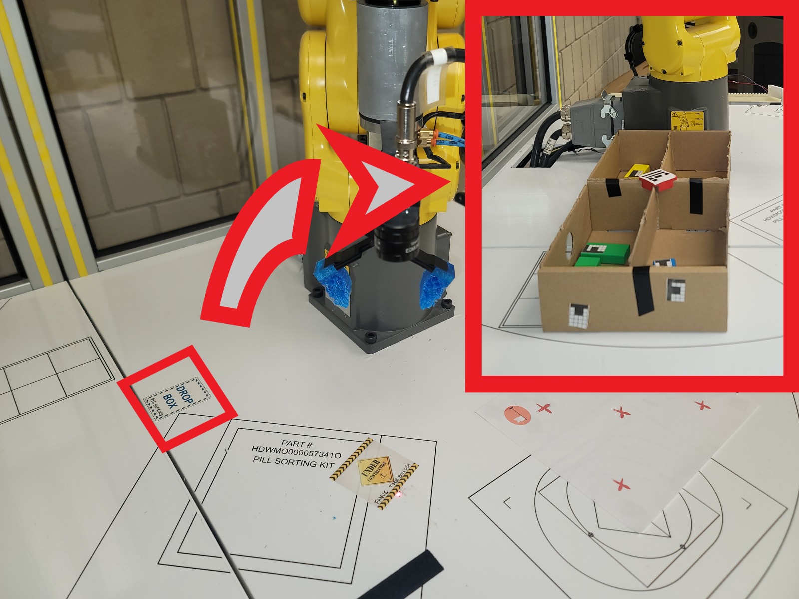
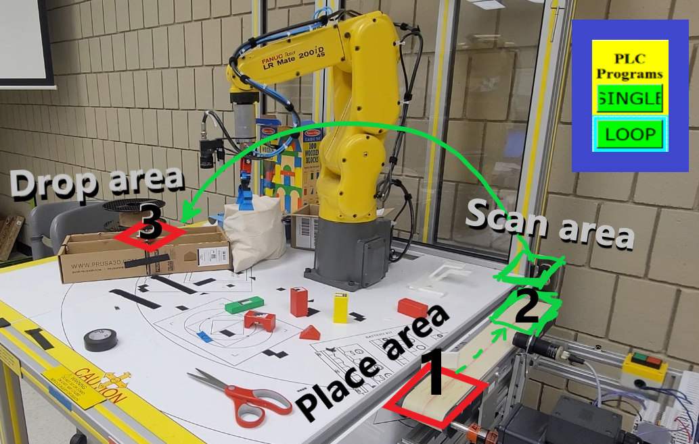
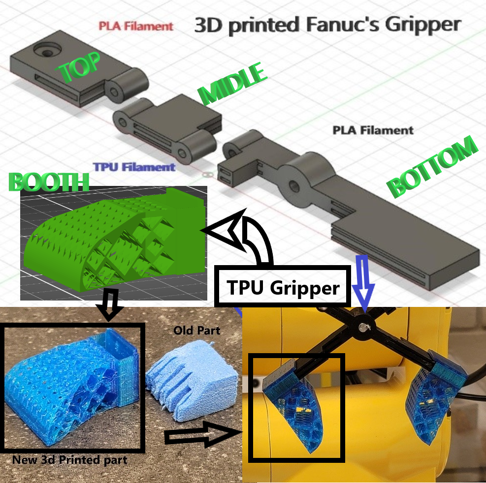

# Fanuc Robot MateLR 200iD 4S Robot Project
### TABLE OF CONTENTS:  
1. [INTRODUCTION](#introduction)  
    1.1 [Project Description](#project-description)  
    1.2 [Project Goals](#project-goals)  
    1.3 [Project Objectives](#project-objectives)  
1. [HMI PROGRAMS:](#HMI-PROGRAMS)  
2. [EXAMPLES OF THE HMI PROGRAMS](#examples-of-the-HMI-programs)   
3. [TP PROGRAMS](#TP-PROGRAMS)   
    3.1 [TP_MAIN](#TP_MAIN)  
    3.2 [TP_BUILD_MAIN](#TP_BUILD_MAIN)  
    3.3 [TP_BUILD_SCAN](#TP_BUILD_SCAN)  
    3.4 [TP_SCAN_AREA](#TP_SCAN_AREA)  
    3.5 [TP_PLC_FIND](#TP_PLC_FIND)  
    3.6 [TP_PLC_SCAN](#TP_PLC_SCAN)  
    3.7 [TP_PLC_MOVE](#TP_PLC_MOVE)  
    3.8 [TP_PLC_DROPBOX](#TP_PLC_DROPBOX)  
4. [HOW TO USE THE CONTROL MENU ON THE TEACH PENDANT](#how-to-use-the-control-menu-on-the-teach-pendant)  
5. [MAIN PROGRAM](#main-program)  
6. [BULDING A HOUSE OF BLOCKS](#building-a-house-of-blocks)  
7. [SORTING PIECES](#sorting-pieces)  
8. [REGISTERS INFORMATION](#registers-information)  
  8.1 [Integer Registers](#integer-register-r)    
  8.2 [String Registers](#strings-registers-st)   
  8.3 [Position Registers](#posoition-registers-pr)  
  8.4 [Global Digital I/O’s](#global-digital-ios)  
9. [3D PRINTED PARTS](#3d-printed-parts)
10. [CONCLUSION](#conclusion) 

---
## INTRODUCTION:
### Project Description:

### Project Goals:

>[x] Create a program that uses the camera to find a pieces on the conveyor and sort the pieces.  
>> [x] move the robot to a specific position and scan the area for a sign to become the pick up point.  
>> [x] move the robot to a specific position and scan the area for a sign to become the drop off point.  
  
>[x] Create a program that can build a house of blocks.   
>> [x] move the robot to a specific position and scan the area for a 5 pieces to build a house with those pieces.  
>> [x] pick up the pieces and move them to a specific position.  
    
>[x] Create a program for the Teach Pendant.    
>> [x] Create a connection between the Teach Pendant and the PLC to read the I/O's state.   
>> [x] Create a connection between the HMI and the Teach Pendant program to control the TP program execution.  
>> [x] Create access to remote and auto mode using system variables to enable the Teach Pendant to control the robot in directly from the HMI program.   
>> [x] Connect all the programs in one main program controlled by the HMI program.  
  
>>[  ] Create a program that can sort the pieces by color.  

### Project Objectives:
The main objectives are:   
Learn how to use the camera to recognize an object, take the information provided by the robot and then use that information to sort the pieces or build a house with them.   
  
Using the Fanuc’s HMI software kit, explore the what can be possible to create, for example an easy to use and powerful Control Menu.  
  
Create a communication between the robot and the PLC allowing them to talk and interact in a synchronize way.  
  
---  
## HMI PROGRAMS:
>#### FANUC_BUILDER.stm
>> SIMPLEFINDER.stm  
>> SETUP.stm  
>> ABOUT.stm  
### Languages and tools used for this part of the project:
HTML, CSS, Javascript, IE, and the Fanuc's HMI Builder software.

  

---  
## EXAMPLES OF THE HMI PROGRAMS:  
   
### ***Main Page  and Objects sorter***    
FANUC_BUILDER.stm is the main page of this project, by default it displays SIMPLEFINDER.stm but using the tabs menu the user can switch to SETUP.stm and ABOUT.stm.  
SIMPLEFINDER.stm contains the main menu that controls this project.
#### FANUC_BUILDER.stm  and SIMPLEFINDER.stm together
  

### ***Building Page***    
This page contains a representation of the blocks that are use to build the house of blocks.  
Red means the piece is missing.  
Green means the piece was found and the position was recorded.  
#### ***SETUP.stm***  
  
  
### ***About Page***     
This page contains information about the team members of this project and there is a QR Code that can be scanned to see the code online.  
### ABOUT.stm
  

---  
## TP PROGRAMS: 

>#### TP_MAIN  
> TP_PLC_ FIND  
>> TP_SCAN_ALL  
>> TP_PLC_MOVE  
>> TP_DROPBOX 
 
> TP_BUILD_MAIN  
>> TP_BUILD_SCAN  
>> TP_SCAN_AREA  
### Languages and tools used for this part of the project:  
Fanuc's Teach Pendant and its TP Programming Language.  

---

#### TP_MAIN  
Program’s Information  
This program controls what is executed from the Teach Pendant.  
  
#### TP_BUILD_MAIN  
Program’s Information  
This is the control program to pick up pieces and build a house. First it calls for TP_BUILD_SCAN and waits for all the pieces to be found then organizes them on top of each other, making them look like a house and after that the program goes back to TP_MAIN.  
If all the pieces are not found it will finish.  
  
#### TP_BUILD_SCAN  
Program’s Information  
This program was created just in case we need to do something special before the real scan happens, for now the only function of this program is to call TP_SCAN_AREA to get all the pieces. 
  
#### TP_SCAN_AREA  
Program’s Information  
In this program we look for 5 pieces on the scan area and record all their positions on the Vision Registers VR [1 to 5] for the TP_BUILD_MAIN to use. 
  
#### TP_PLC_FIND  
Program’s Information   
The program cycle for picking  up a piece from the conveyor start here, the PLC waits for a signal from robot to start running the conveyor, if a piece is available the PLC signals the robot to call for TP_PLC_SCAN, once the robot finds the new piece using the camera, the robot arm will use its grippers to grab and move the found piece to the “drop area” finishing the program and going back to the TP_MAIN program, all this is done using the sub programs below.  
  
#### TP_PLC_SCAN  
Program’s Information  
This program tries to find a piece on the conveyor by scanning the area, if a piece is found, its position will be saved on the Vision Register VR [2] otherwise the scanning ends. 
  
#### TP_PLC_ MOVE  
Program’s Information  
The main function of this program is to pick up the found piece from the conveyor using the stored position, after this process the TP_PLC_ DROPBOX will be called. 
  
#### TP_PLC_ DROPBOX  
Program’s Information  
This program is designed to move the found piece to a programmed position using position registers, then the robot will scan for a bar code that is placed on top of the drop off box, if the box is not found then the arm will just let the piece go opening the gripper on that last spot. 
  
### At the end of this document, you can see all the registers, their values and information corresponding to their use on this program. 

---  
## HOW TO USE THE CONTROL MENU ON THE TEACH PENDANT
  
1.  Controls the Auto or Remote state of the robot  
  
2. Executes the main program. “TP_MAIN” ones the program starts running it will stay on a loop waiting for instructions. If a program is running it needs to end it first before it can run another program, this allows us to make our project scale-able   
  
3. Ask the main program to start TP_BUILD_MAIN   
  
4. Contains the instructions to run the TP_PLC_FIND     
  4.2. Ask the main program to start TP_PCL_FIND unlimited times    
  4.3. Ask the main program to wait for the program to stop the loop after the TP_PCL_FIND is done  
  
  
5. Contains some controls that help us on our system  
  5.1 Turns ON/OFF alarm when pieces are found.  
  5.2  Turns ON/OFF laser pointer on robot.  
  5.3 Show us the state of the signal coming from the PLC    
  5.4 Turns ON/OFF the signal that allows us to bypass the PLC.  
  
  
6. Ask the main program to stop TP_BUILD_MAIN after finishing any cycle that is working on  
  
  
7. Ask the main program to stop TP_BUILD_MAIN after finishing any cycle that is working on, this button is located on the top the Main screen  
  
#### Below are the pictures and their corresponding numbers.  
 
--- 
## MAIN PROGRAM
After reading all the warnings and having an idea of what our project does, we can start with the first program.  
For the project to work, the Robot’s Computer must be on Auto and Teach pendant OFF, and all errors must be cleared off.   
1. Robot must be in REMOTE mode.  
2. Start the TP_MAIN program.  
  
## BUILDING A HOUSE OF BLOCKS  
1. Place all 5 pieces on the area marked as Scan area. Please make sure each piece is at least 1 and ½ inches apart to avoid damaging the robot’s grippers. There are 5 marks for a better idea of where to place each piece.  
2. On the menu click on BUILD and watch the robot build a house of blocks.   
  
After the robot finishes the house, it will wait for the next instruction.  
  
We can check what pieces have been found by looking at the building page.  
 
---
## SORTING PIECES 
1. Place piece on the place area.  
2. Select SINGLE or LOOP cycle and wait for cycle to start.   
Please place the box used to sort the pieces on the top of DROP BOX sign, there is an example below. 
  
  
### What does the cycle do?  
  
Once the piece is place on the “Place area” the conveyor moves it to the “Scan area,” the robot camera will try to find the piece and move it to the “Drop area,” again the robot will use the camera to find the box position and orientation, then drop the found piece in the correct compartment.  
  

---
  
## REGISTERS INFORMATION:  
### Integer Register R[]  
|     Group Variable  |   Caption        |   Register Number  |   Value  |   Description                                                                                                                                                                 |
|---------------------|------------------|--------------------|----------|-------------------------------------------------------------------------------------------------------------------------------------------------------------------------------|
|     TP_PLC_DROPBOX  |   CAP_LOOP       |   1                |   0-4    |   Loop counter                                                                                                                                                                |
|     TP_PLC_DROPBOX  |   CAP_DROP_POSS  |   2                |   0-4    |   Robot uses this to know what object was found and then will know where to go to drop the piece                                                                              |
|     TP_PLC_DROPBOX  |   CAP_DROP_JMP2  |   3                |   5-8    |   String Registers                                                                                                                                                            |
|     TP_PLC_DROPBOX  |   CAP_DROP_PR    |   4                |   math   |   Robot uses this to calculates where to drop the piece                                                                                                                       |
|     PLC Scanning    |   CAP_OBJ_FOUND  |   5                |   0-2    |   0=not found, 1 = Found & 2 = Searching                                                                                                                                      |
|     TP_SCAN_AREA    |                  |   6                |   10-14  |   Object Counter                                                                                                                                                              |
|     PLC Scanning    |   Direction      |   14               |   0-1    |    0 = Left & 1 = Right                                                                                                                                                       |
|     PLC Scanning    |   ScanX          |   15               |   0-10   |   This set the X limit for the area to scan the PLC                                                                                                                           |
|     PLC Scanning    |   ScanY          |   16               |   0-10   |   This set the Y limit for the area to scan the PLC                                                                                                                           |
|     TP_PLC_SCAN     |   MaxScanPLCX    |   17               |   0-10   |   This set the X limit for the area to scan the PLC                                                                                                                           |
|     TP_PLC_SCAN     |   MaxScanPLCY    |   18               |   0-10   |   This set the Y limit for the area to scan the PLC                                                                                                                           |
|     TP_SCAN_AREA    |   MaxScanAreaX   |   19               |   0-10   |   This set the X limit for the area to scan the build pieces                                                                                                                  |
|     TP_SCAN_AREA    |   MaxScanAreaY   |   20               |   0-10   |   This set the Y limit for the area to scan the build pieces                                                                                                                  |
|     TP_SCAN_AREA    |   MaxObjs2Scan   |   21               |   0-5    |   The number of objects to look for to build                                                                                                                                  |
|     TP_MAIN         |   PROG_SELECTED  |   0-4              |   22     |   After selecting a program  0 = Run main on a loop  1 = Run TP PLC one time  2 = Run TP PLC on a loop  3 = TP BUILD  4 = End the Main Program  5 = Sub programs are running  |
|     TP_SCAN_AREA    |   a              |   25               |   0-1    |   Use by TP_SCAN_AREA to know if piece was found                                                                                                                              |
|     TP_SCAN_AREA    |   b              |   26               |   0-1    |   Use by TP_SCAN_AREA to know if piece was found                                                                                                                              |
|     TP_SCAN_AREA    |   c              |   27               |   0-1    |   Use by TP_SCAN_AREA to know if piece was found                                                                                                                              |
|     TP_SCAN_AREA    |   d              |   28               |   0-1    |   Use by TP_SCAN_AREA to know if piece was found                                                                                                                              |
|     TP_SCAN_AREA    |   found_build    |   30               |   0-5    |   Use by TP_SCAN_AREA to know if piece was found                                                                                                                              |
|     TP_SCAN_AREA    |                  |   32               |   0-5    |   Use by TP_SCAN_AREA to count total pieces                                                                                                                                   |

### Strings Registers ST[]
|     Group Use      |   Caption          |   Value            |   ID  |   Description                                                |
|--------------------|--------------------|--------------------|-------|--------------------------------------------------------------|
|     TP_FIND_PLC    |   OBJ_PLC_1        |   OBJ_PLC_1        |   1   |   Object name for PLC scanner                                |
|     TP_FIND_PLC    |   OBJ_PLC_2        |   OBJ_PLC_2        |   2   |   Object name for PLC scanner                                |
|     TP_FIND_PLC    |   OBJ_PLC_3        |   OBJ_PLC_3        |   3   |   Object name for PLC scanner                                |
|     TP_FIND_PLC    |   OBJ_PLC_4        |   OBJ_PLC_4        |   4   |   Object name for PLC scanner                                |
|     TP_DROPBOX     |   OBJ_PLC_DROPBOX  |   OBJ_PLC_DROPBOX  |   5   |   Object name for the symbol box                             |
|     TP_MAIN        |   message          |   message          |   6   |   Shows a message, if we implement this part on the program  |
|     TP_SCAN_AREA   |   BUILD_1          |   OBJ_BUILD_1      |   10  |   Object name for TP_BUILD scanner                           |
|     TP_SCAN_AREA   |   BUILD_2          |   OBJ_BUILD_2      |   11  |   Object name for TP_BUILD scanner                           |
|     TP_SCAN_AREA   |   BUILD_3          |   OBJ_BUILD_3      |   12  |   Object name for TP_BUILD scanner                           |
|     TP_SCAN_AREA   |   BUILD_4          |   OBJ_BUILD_4      |   13  |   Object name for TP_BUILD scanner                           |
|     TP_SCAN_AREA   |   BUILD_5          |   OBJ_BUILD_5      |   14  |   Object name for TP_BUILD scanner                           |
|     Simple Finder  |   obj_1            |   obj_1            |   22  |   This is the object to be selected                          |
|     Simple Finder  |   OBJ_1_2D_SCAN    |   Program Modify   |   24  |                                                              |
|     Simple Finder  |   OBJ_1_2D         |   Program Modify   |   25  |   Selecting Object 1 of 2D camera (green square)             |

### Posoition Registers PR[]
|     Group Use        |   Caption           |   ID  |   Values          |   Description                                                        |
|----------------------|---------------------|-------|-------------------|----------------------------------------------------------------------|
|     General use      |   HOME              |   1   |   Recorded        |   User Frame and Camera was setup in this position                   |
|     TP_SCAN_PLC      |   cap_PLC_cam2scan  |   14  |   Recorded        |   Position the camera to scan conveyor for pieces                    |
|     TP_SCAN_PLC      |   cap_PLC_cam2dro   |   15  |   Recorded        |   Position the camera to scan for box symbol                         |
|     TP_SCAN_PLC      |   cap_pick_PLC      |   19  |   Recorded        |   Position to go and pick up part, we reuse this PR for all objects  |
|     TP_SCAN_PLC      |   cap_plc_cls2drop  |   21  |   Recorded        |   Position the tool close to the box to drop                         |
|     TP_SCAN_PLC      |   cap_plc_drop_xy   |   22  |   Manually Enter  |   Position to drop piece after scanning where the box is             |
|     TP_SCAN_PLC      |   cap_plc_drop_xyz  |   23  |   Program Math    |   Calculates new position using PR[22] and the PR[43-46]             |
|     TP_SCAN_ARE      |   cap_build_2       |   25  |   Recorded        |   Position to pick up 2 of the TP_BUILD pieces                       |
|     TP_SCAN_ARE      |   cap_build_3       |   26  |   Recorded        |   Position to pick up 1 piece of the TP_BUILD                        |
|     TP_SCAN_ARE      |   cap_build_4       |   27  |   Recorded        |   Position to pick up 1 piece of the TP_BUILD                        |
|     TP_SCAN_ARE      |   cap_build_home    |   28  |   Recorded        |   Position to build the house                                        |
|     General use      |   cap_curr_poss     |   30  |   Program Modify  |   The program uses this PR to know the current position              |
|     Offset Position  |   cap_add_z         |   40  |   Z = 25 Manual   |   Manually enter values                                              |
|     Offset Position  |   cap_add_x         |   41  |   X = 10 Manual   |   Manually enter values                                              |
|     Offset Position  |   cap_add_y         |   42  |   Y = 10 Manual   |   Manually enter values                                              |
|     Offset Position  |   cap_add_x50       |   43  |   X = 50 Manual   |   Manually enter values                                              |
|     Offset Position  |   cap_add_y50       |   44  |   Y = 50 Manual   |   Manually enter values                                              |
|     Offset Position  |   cap_subtract_x50  |   45  |   X = -50 Manual  |   Manually enter values                                              |
|     Offset Position  |   cap_subtract_y50  |   46  |   Y = -50 Manual  |   Manually enter values                                              |

### Global Digital I/O’s
|     Group   |   Caption              |   ID   |   Values    |   Description                                                         |
|-------------|------------------------|--------|-------------|-----------------------------------------------------------------------|
|     INPUT   |   PLC_IN               |   101  |   ON – OFF  |   Comes from PLC -> If ON then a new object is ready to be picked up  |
|     OUTPUT  |   PLC_OUT              |   109  |   ON – OFF  |   Signal going to the PLC to run the conveyor                         |
|     OUTPUT  |   SUB_RUNNING          |   115  |   ON – OFF  |   If ON, we can change Toggle Button                                  |
|     OUTPUT  |   simdio108            |   116  |   ON – OFF  |   In case the PLC is not working this will bypass DI[101]             |
|     OUTPUT  |   CAP_ALLOW_EXECUTION  |   118  |   ON – OFF  |   If ON, then run TP_PLC_FIND                                         |
|     OUTPUT  |   CAP_ALLOW_EXECUTION  |   120  |   ON – OFF  |   If ON alarm will sound when a piece is found                        |  
---  
## 3D PRINT PARTS FOR THE ROBOT
### ***3D Printed Parts***
 
|     Part Name       |   Quantity   |   Description                                                                 |
|---------------------|--------------|-------------------------------------------------------------------------------|
|     TOP        |   2          |   These parts are going to be screwed to the robot grippers.             |
|     MIDLE       |   2          |   These parts are going to be on the middle offering some flexibility, because they are made of TPU filament.               |
|     BOTTOM        |   2          |   These parts go in the middle allowing us to gaing pressure and space to grab biger pieces.                |
|     BOOTH      |   2          |         These parts act like little booths allowing us to move them around and adjusting the grippers reach.            | 
       
  [Find 3D models to print](https://www.thingiverse.com/thing:4812029)  
---
